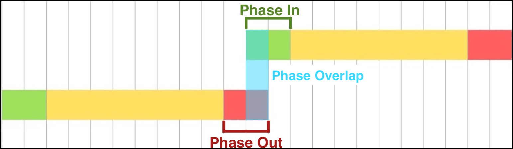

# Ixhibition (beta)
*Image Exhibition*

A Javascript generated CSS3 Animation based image gallery, providing control over the transitioning/seguing of slides.
<br />
###Overview
Ixhibition is an image gallery generated in Javascript and powered by CSS3 Animations, with the additional advantage of being able to set custom and desired animations using CSS3 Animation supported attributes. Ixhibition is also intended to serve as a core library on which additional packages may be developed, for additional and/or specific functionality, including providing a more animation sets and for connecting to other APIs and libraries.

Ixhibition is 100% open source.

###Aims
Ixhibition has been developed with the goal of reducing as much Javascript interaction as possible. What is meant by this is that while JS is used to instantiate and generate the gallery (HTML and CSS), JS is meant to play no role after loading it into the DOM: all animation and transitioning is governed by CSS3 animations only. Therefore, once the gallery has been loaded into the DOM, Ixhibition will not be performing and executing any further JS unless invoked by a public function.
<br />
<br />
#Using Ixhibition

##Getting Started
Firstly, before instantiating the library in javascript, a `<div>` tag with an ID must be created for the library to use. By default, the library looks for a `<div>` tag with the ID *"ixhibition"*, however another ID value can be used as long as it is passed when the library is instantiated. The `<div>` tag used **must** have an explicit `height` and `width` set, with other attributes being optional, such as `border` and `background-color`.
<br/>Instantiation will populate the assigned div tag, and will append `<style>` tags to the head in which the associated CSS will be injected in, including the animations.

####Default ID
CSS: `#ixhibition{ height: 360px; width: 640px; }`

HTML: `<div id="ixhibition"></div> `

Javascript: `var ixb = Ixhibition();`


####Custom ID
CSS: `#myGallery{ height: 360px; width: 640px; }`

HTML: `<div id="myGallery"></div>`

Javascript: `var ixb = Ixhibition("myGallery");`


##Logic
The following example provides a general overview of the logic used by Ixhibition:


##Loading Images
In order to load a set of images in, an array of image urls in string format must be passed as the parameter into the `setImageList(imgList)` function.

```javascript
var imgList = [
    "images/image1.jpg",
    "images/image2.jpg",
    "images/image3.jpg",
    "images/image4.jpg"
];

ixb.setImageList(imgList);
```

##Setting Segue Type
There are 5 built in segue (transition) animations which dictate the transitioning from image to image. These include: **"stack"**, **"vertical"**, **"vertical-reverse"**, **"horizontal"** and **"horizontal-reverse"**. The default is "vertical".

<table style="width: 100%; border: none;">
    <tr style="background-color:#FFF;">
        <td> `ixb.setSegueType("stack");` </td>
        <td style="text-align: center;">  </td>
    </tr>
    <tr style="background-color:#FFF;">
        <td> `ixb.setSegueType("vertical");` </td>
        <td style="text-align: center;">  </td>
    </tr>
    <tr style="background-color:#FFF;">
        <td> `ixb.setSegueType("vertical-reverse");` </td>
        <td  style="text-align: center;">  </td>
    </tr>
    <tr style="background-color:#FFF;">
        <td> `ixb.setSegueType("horizontal");` </td>
        <td  style="text-align: center;">  </td>
    </tr>
    <tr style="background-color:#FFF;">
        <td> `ixb.setSegueType("horizontal-reverse");` </td>
        <td  style="text-align: center;">  </td>
    </tr>
</table>

##Setting Display Duration
In order to set the display duration (in seconds), a positive number must be set as the parameter:
```javascript
ixb.setDisplayDuration(4);
```


##Setting Phases
Phase values (phaseIn and phaseOut) indicate the duration values (in seconds) for transitioning in and out for a slide respectively. Only positive numbers are accepted for these values.
```javascript
var phaseIn_duration = 2,
    phaseOut_duration = 2;
```


Phase animations indicate what animation should be performed during the phaseIn and phaseOut durations. These are defined by passing in an array of objects. The objects must contain key-value pairs where the key is the must be a CSS3 attribute and the value should be the associated CSS3 value. Each object in the array is treated as a key frame, and the number of objects indicate the number of key frames, divided at regular intervals: therefore the array must either be 0 or 2 and greater, (an array of length 1 will throw an error).

```javascript
var phaseIn_animation = [
        {"transform" : "scale(0.7, 0.7)"},  //Keyframe @ 0% of phaseIn
        {"transform" : "scale(0.7, 0.7)"},  //Keyframe @ 50% of phaseIn
        {"transform" : "scale(1, 1)"}       //Keyframe @ 100% of phaseIn
    ],
    phaseOut_animation = [
        {"transform" : "scale(1, 1)"},      //Keyframe @ 0% of phaseOut
        {"transform" : "scale(0.7, 0.7)"},  //Keyframe @ 50% of phaseOut
        {"transform" : "scale(0.7, 0.7)"}   //Keyframe @ 100% of phaseOut
    ];

//Example 2
var phaseIn_animationB = [
        {"transform" : "scale(0.7, 0.7)"},  //Keyframe @ 0% of phaseIn
        {"transform" : "scale(0.7, 0.7)"},  //Keyframe @ 25% of phaseIn
        {"transform" : "scale(0.7, 0.7)"},  //Keyframe @ 50% of phaseIn
        {"transform" : "scale(0.7, 0.7)"},  //Keyframe @ 75% of phaseIn
        {"transform" : "scale(1, 1)"}       //Keyframe @ 100% of phaseIn
    ],
    phaseOut_animationB = [
        {"transform" : "scale(1, 1)"},      //Keyframe @ 0% of phaseOut
        {"transform" : "scale(0.7, 0.7)"},  //Keyframe @ 20% of phaseOut
        {"transform" : "scale(0.7, 0.7)"},  //Keyframe @ 40% of phaseOut
        {"transform" : "scale(0.7, 0.7)"},  //Keyframe @ 60% of phaseOut
        {"transform" : "scale(0.7, 0.7)"},  //Keyframe @ 80% of phaseOut
        {"transform" : "scale(0.7, 0.7)"}   //Keyframe @ 100% of phaseOut
    ];
```
**Note:** it may be necessary to include prefixed version of the CSS attributes, such as `-webkit-`.

Both `setPhaseIn(pIn_duration, pIn_animation)` and `setPhaseOut(pOut_duration, pOut_animation)` functions require 2 parameters, where the first value is the duration (as a positive integer), and the second parameter requires the associated phase animations (as an array of objects), like so:

```javascript
ixb.setPhaseIn(phaseIn_duration, phaseIn_animation);
ixb.setPhaseOut(phaseOut_duration, phaseOut_animation);
```

####Static vs Dynamic Display
**Static:** This is the most common option. In order to achieve a static display, the last (keyframe) object in the phaseIn animation and the first object in the phaseOut animation must match.

```javascript
var phaseIn_animation = [
        {"transform" : "scale(0.7, 0.7)"},
        {"transform" : "scale(0.7, 0.7)"},
        {"transform" : "scale(1, 1)"}
    ],
    phaseOut_duration = [
        {"transform" : "scale(1, 1)"},
        {"transform" : "scale(0.7, 0.7)"},
        {"transform" : "scale(0.7, 0.7)"}
    ];
```

**Dynamic:** This option is when you want the apply a simple/basic animation during the display. The last (keyframe) object in the phaseIn animation and the first object in the phaseOut animation may have simple differences.

```javascript
var phaseIn_animation = [
        {"transform" : "scale(0.7, 0.7)"},
        {"transform" : "scale(0.7, 0.7)"},
        {"transform" : "scale(1, 1)"}
    ],
    phaseOut_duration = [
        {"transform" : "scale(1.05, 1.05)"},
        {"transform" : "scale(0.7, 0.7)"},
        {"transform" : "scale(0.7, 0.7)"}
    ];
```

##Setting Phase Overlap
The phase overlap dictates how much of the phaseOut duration of the phasing-out slide and how much of the phaseIn duration of the phasing-in slide overlap in seconds.

```javascript
ixb.setPhaseOverlap(1);
```

This provides control over the transitioning and can be used to achieve specific animations.

<br />
##Segue Duration
The segue duration accepts two values: "full" and "overlap". The segue duration indicates at what point the transition (going from one slide to the next) occurs and how long it lasts.
<br/>If **"full"** (default) is set, then the segue duration is indicated by:  phaseOut + phaseIn - phaseOverlap. The segue duration starts at the beginning of the phaseOut duration of the phasing-out slide and ends at the end of the phaseIn duration of the phasing-in slide. Note: if segue type is "stack", the segue duration is set to "full" regardlessly.
```javascript
ixb.setSegueDuration("full");
```


<br/>If **"overlap"** is set, then the segue duration is equal to the phaseOverlap value and starts and ends at the same time.
```javascript
ixb.setSegueDuration("overlap");
```


##Set Loop Count
This indicates how many times the gallery should loop, and maps exactly to the animation-iteration-count attribute in CSS3: any legal value for the attribute will be accepted as the parameter, including "infinite".
```javascript
ixb.setLoopCount(1);
//Or
ixb.setLoopCount("infinite");
```


##Setting Fading
It is possible to indicate whether fading in and/or out is desired, which occurs during the full duration of the phaseIn and phaseOut values respectively: 2 parameters are required, the first parameter being for phaseIn and the second being for phaseOut.
```javascript
ixb.setFade(true, true);
```

##Saving and Loading Options
###Saving
It is possible to save a preset and load it later. To do so, the `saveOption(keyname, callback)` function is used. The function requires 2 parameters: a preset *keyname* as a string, and a *callback* function which accepts a single parameter and must return an object.

<br />The object provided (from the parameter) is a data object containing the following attributes:
```javascript
data = {
    "displayDuration" : 4,  //Provides display duration value
    "phaseInDuration" : 2,  //Provides phaseIn duration value
    "phaseOutDuration" : 1, //Provides phaseOut duration value
    "phaseOverlap" : 0.5    //Provides phaseOverlap duration value
}
```

<br />The return object may contain any of the following keys/attributes with corresponding values:
```javascript
{
    "segueType" : "vertical",       //(see Setting Segue Type)
    "phaseInDuration" : 2,          //(see Setting Phases - phaseIn_duration)
    "phaseInAnimations" : [],       //(see Setting Phases - phaseIn_animation)
    "phaseOutDuration" : 2,         //(see Setting Phases - phaseOut_duration)
    "phaseOutAnimations" : [],      //(see Setting Phases - phaseOut_animation)
    "phaseOverlap" : 1,             //(see Setting Phase Overlap)
    "segueDuration" : "overlap",    //(see Setting Segue Duration)
    "fadeIn" : false,               //(see Setting Fading - fadeIn)
    "fadeOut" : false               //(see Setting Fading - fadeOut)
}
```

<br />A callback function allows presets to perform calculations if desired before returning the object with desired attributes.
```javascript
ixb.saveOption("test-option", function(data){

    var higherVal = Maths.max(data.phaseInDuration, data.phaseOutDuration);
    var pIn = higherVal,
        pOut = higherVal;
    var pOverlap = pIn / 2;

    var settingsX = {
        "segueType" : "vertical",
        "phaseInDuration" : pIn,
        "phaseInAnimations" : [
            {"transform" : "scale(0.7, 0.7)"},
            {"transform" : "scale(0.7, 0.7)"},
            {"transform" : "scale(1, 1)"}
        ],
        "phaseOutDuration" : pOut,
        "phaseOutAnimations" : [
            {"transform" : "scale(1.05, 1.05)"},
            {"transform" : "scale(0.7, 0.7)"},
            {"transform" : "scale(0.7, 0.7)"}
        ],
        "phaseOverlap" : pOverlap,
        "loopCount" : 3,
        "segueDuration" : "overlap",
        "fadeIn" : false,
        "fadeOut" : false
    };

    return settingsX;

});
```


###Loading
If a preset has been saved, then the `loadOption(keyname)` function can be used to load it, given the associate keyname:
```javascript
ixb.loadOption("test-option");
```

####Defaults
A set of default animation options are provided:

Option | Description
---|---
ixb_1 | Stack (no fade)
ixb_2 | Vertical simple
ixb_3 | Vertical-reverse simple
ixb_4 | Horizontal simple
ixb_5 | Horizontal-reverse simple
ixb_6 | Stack with fade
ixb_7 | Fade, with fade-out drop
ixb_8 | Slide focus, with slight zoom
ixb_9 | Squash to focus
ixb_10 | Fold-in Fold-out 


##Restarting
By default, if any attribute is changed (except for `setImageList(imgList)`), the animation will simply continue depending on where the animation should be time-wise. If a complete restart of the animation is required, the following can be called:
```javascript
ixb.restart();
```


<br />
<br />
#Creating Packages (Add-ons)
It is encouraged to develop and use packages that utilise Ixhibition, especially packages that add more  animation sets and ones that provide additional functionality. However, in an attempt to streamline and standardise this such that multiple packages could be used in a project, a set of guidelines are provided.

##General Guidelines
These guidelines apply to all packages:

1. The package should request for an instance of ixhibition to be passed in as the parameter when the package is instantiated. E.g.

    ```javascript
    var ixb = Ixhibition();

    //Do either:
    MyPackage(ixb); //Useful for packages only dealing with simple animation options
    //Or
    var mypackage = MyPackage(ixb); //Used for all other types of packages
    ```

2. It is not advised to modify the Ixhibition object itself, including adding more functions, changing functions, and deleting functions. Ixhibition has been developed in an encapsulated and self-contained format, and therefore any modification to the object may have unintended consequences. The only form of acceptable interaction is through the provided functions from the object.

3. It is strongly recommended to provide documentation for the package if the package is intended to be
for public use (should go without saying).

##Animation-oriented Package Guidelines
Packages that only provide additional animation sets should follow these requirements:

1. In order to avoid conflict, the keynames for the animations provided by the package should start with the package name or abbreviation, followed by an underscore, and finally followed by the preset name, i.e. *{package name}* __ *{preset name}*
<br/> An example would be if the package is called *MyAnimation*, then the keynames would follow these patterns: myanimation_[preset name] or ma_[preset name]
<br /> e.g. myanimation_1 or ma_1

    ```javascript
    //Example of saving a preset:
    ixb.saveOption("ma_1", function(data){

        var settingsX = {
            "segueType" : "vertical",
            "phaseInDuration" : 2,
            "phaseInAnimations" : [
                {"transform" : "scale(0.7, 0.7)"},
                {"transform" : "scale(0.7, 0.7)"},
                {"transform" : "scale(1, 1)"}
            ],
            "phaseOutDuration" : 2,
            "phaseOutAnimations" : [
                {"transform" : "scale(1.05, 1.05)"},
                {"transform" : "scale(0.7, 0.7)"},
                {"transform" : "scale(0.7, 0.7)"}
            ],
            "phaseOverlap" : 1,
            "segueDuration" : "overlap",
        };

        return settingsX;

    });
    ```

2. When using preset options, due to possible additional calculations required within the preset based of the `data` object provided ([see Saving](#saving)), it may be neccessary for the `loadOption(keyname)` function to be executed relatively last; i.e. after setting `setDisplayDuration(displayDuration)`, `setPhaseIn(pIn_duration, pIn_animation)`, `setPhaseOut(pOut_duration, pOut_animation)`, and/or `setPhaseOverlap(poDuration)`. Therefore, if dependant on any of the values provided by the `data` object, then it will be necessary to explain this within the package documentation or preferably provide functions from the package object which take into account and deal with these attributes.

##Functionality-oriented (and other) Package Guidelines
Packages that provide additional functionality with or without animation sets should follow these requirements:

1. It is recommended that the package (object) is encapsulated and self-contained (similar to Ixhibition), and provides (public) functions in order to perform various tasks. This is not only to regulate name-space,  but also to retain and maintain control within the package itself.

2. The package may be dependent on other APIs and/or Libraries, and therefore this should be made clear within the package documentation, and possibly resolve the dependancies itself by appending the required scripts to the DOM upon package instantiation.

3. Animations should follow the [Animation Package Guidelines](#animation-package-guidelines) and provide (public) functions regardlessly.
